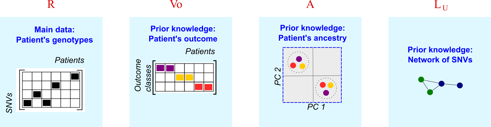
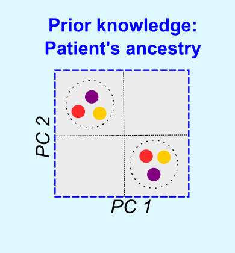
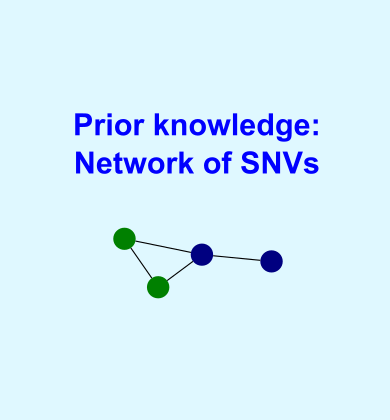

<style type="text/css">

body{
  font-size: 14pt !important;;
}
</style>


----

## Description


The algorithm takes four sources of data in the input:   

<br>



<br>

  * $R$ is a relationship matrix for the **genotyping data**. This matrix encodes the number of copies of the recessive allele carried by the patients at each SNV.    
  * $V_o$ is an outcome matrix for the **phenotyping data**. This matrix encodes the  categorical clinical outcome for each patient (*e.g.*, case or control).    
  * $A$ is a kernel similarity matrix encoding the **population origin** of the patients. This kernel captures the similarity between patients in the principal components space generated by $R$. 
  * $L_U$ is the Laplacian matrix of a **SNV-SNV network**. This network contains information about the genes harbouring the SNVs and the protein-protein interactions that might be disrupted by the SNVs' deleteriousness effect.   


<br>


---- 

## The relationship matrix, $R$  

<br>

<center></center>

<br>

  We set $R_{(n \times m)}$ to encode the genotypes of $m$ patients across $n$ SNVs under an additive genetic model. Thus, the entries of $R$ are 0, 1 or 2 depending on the number of recessive allele copies carried by the patient at a given SNV.  
  
<br>  
  
### Constructing the relationship matrix

<br>
  
  We cannot provide you with a function to contruct $R$ because the genotyping data format is highly variable and must be pre-processed depending on your research needs. Here we included a dummy example of this matrix (`data(R)`), and sketched some guidelines to create $R$ in your script:
  
  1. Filter the variants and patients that you want to include in $R$. Bearing in mind the memory RAM available in your machine, you could start the analysis with small matrices (*e.g.*, 1000 SNVs by 500 patients) and scale the process afterwards.
  
  2. Construct the relationship matrix considering $G_{i,j}$, the genotype of patient $j$ in the SNV $i$ with alleles $A$ and $B$. The entries of the matrix are:
    * $R_{i,j} = 0$  if $G_{i,j} = AA$
    * $R_{i,j} = 1$ if $G_{i,j} = AB$ 
    * $R_{i,j} = 2$ if $G_{i,j}= BB$.  
    
  3. Store the matrix in an object called `R`
  
  
  This matrix should look like:

```{r setup, include=TRUE}
  library(cnmtf)
  R[ 1:10, 1:5 ]
```

  
<br>
  
### Metadata for the variants

<br>

It is important to keep meta information on the localisation of the variant:

1. Construct a data frame called `tmap` to map every variant with their gene (entrezid), the chromosome and the position of the SNV in the chromosome. 

2. Name the columns of `tmap` as:

```
    colnames(tmap) <- c("refsnp_id","entrezgene","chr","position")
```

This dataframe should look like:

```{r, include=TRUE}
  head(tmap)
```
```{r, include=FALSE}
knitr::kable( tmap[1:5,], caption = "Chromosomal location of SNVs.")
```  

<br>

### Find variants in Linkage-disequilibrium (LD)

<br>

Variants in LD tend to obscure the signals of association from weak loci in cNMTF, so we only keep one variant representing a gene region in high LD.  

Use the function `find.snps.ld` to calculate LD between pairs of SNVs and save the results in a workspace `"fileLD.RData"`:

```{r eval=F}

    library("LDcorSV")
    cnmtf:::find.snps.ld( file.LD = "./test/fileLD.RData",	
                          type.ld = "gene", 
                          tmap = tmap, R = R)

```

The algorithm will read this workspace file and filter out the variants for you.

<br>


---- 

## The outcome matrix for the phenotypes, $V_o$

<br>

<center></center>

<br>


The outcome matrix $V_o$ has dimmensions of $m$ patients by $k_2$ outcome categories. We set $k_2 = 2$ because we are studying binary outcomes or cases-control designs. The entries of this matrix are:

 * $V_{o [j,1]} = 1$ if patient $j$ is a control ($V_{o [j,1]} = 0$ otherwise) 
 * $V_{o [j,2]} = 1$ if patient $j$ is a case ($V_{o [j,2]} = 0$ otherwise). 

To constuct this matrix you only need to define a categorical vector of outcomes, `out`: 


```{r, include=TRUE}
  head(out)
```

Now run the function `construct.Vo`:

```{r, include=TRUE}  
  Vo = cnmtf:::construct.Vo( out = out, ki = 2)
  head(Vo)
``` 


<br>


---- 

## The kernel matrix for the ancestry,  $A$ 

<br>

<center></center>

<br>


This is a predefined matrix ($m \times m$) generated by a kernel function on the population of the patients.  If the population origin is known we can fit the kernel matrix as:

 * $A_{i,j} = 1$ if patient $i$ and patient $j$ belong to the same population.
 * $A_{i,j} = 0$ otherwise.  
 
However, the population origin is frequently unknown, so it must be inferred via Principal Component Analysis (PCA). The kernel $A$ is defined by the similarity between patients in the principal components space	$A =  RR^T / n$, using the function `kernels.cnmtf`:

<br>

```{r, include=TRUE}  
  kernels = cnmtf:::kernels.cnmtf(R = R, pop = "unknown")

 #This function returns the population origin kernel:
  A = kernels[[2]]
  A[ 1:5, 1:5]
  
 
``` 


<br>

---- 

## The SNV-SNV network, $L_U$

<br>

<center></center>

<br>

Finally, we construct a SNV-SNV network containing information about the genes harbouring the SNVs and their protein-protein interactions (PPIs).

You will need a table of edges from a PPI network (*e.g*, BioGrid).  We included an example of this table, called `dedges`, containing the edges between pairs of proteins. The identifiers must be the entrezids of the genes:

```{r , include=TRUE}
  head(dedges)

```

Call the function `create.network`:

```{r eval=F, include=TRUE}
library('doParallel')
library('biomaRt')
library("igraph")
cnmtf:::create.network( net.type = "ppi", #Type of reference network
                        dedges = dedges, #Object with edges from reference network
                      
          				#Parameters for Linkage Disequilibrium
          				remove.highLD = TRUE,
          				ld.tao = 0.8, #Treshold of LD
          				res.ld = "./test/fileLD.RData", #Table of LD
          				
          				#Parameters to construct Wu
          				R.snps = rownames(R), #List of SNPs in R
          				work.dat = "./test/", #Working directory
          				trait.project = "test", #Trait
          				n.cores = 3, #Number of cores for parallel computing
          				tmap = tmap, #Mapping of SNPs to genes
          				plot.file = "Gu_ppi_test_venn.pdf" )
```

The results of this function will be saved in the working directory that you specify with `work.dat`. In this example, `work.dat = "./test/"`. 

<br>

---- 

Your input data is ready so the next step is [to run cNMTF](running.html) !
