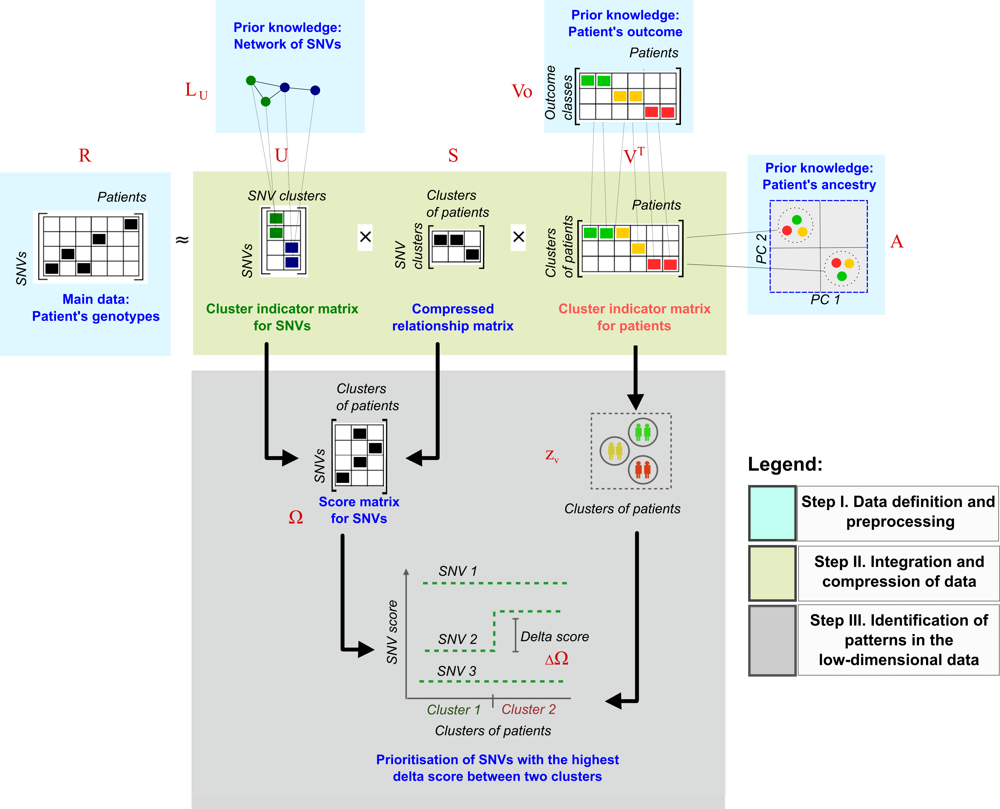

<style type="text/css">


body{
  font-size: 13pt !important;;
}
</style>


----

## Overview  


After running the main function of cNMTF, `score.cnmtf` you have a workspace with the consensus clusters of patients and SNV scores. In this section we will compare the SNV scores between clusters to observe the relative importance of each SNV on a trait. Those SNVs with high delta score, $\Delta \Omega$, will be prioritised for further analysis: 

<br>



<br>

---- 

## The delta SNV score

<br>

In our results, we can expect clusters of patients enriched either in cases or controls because we are integrating $V_o$. The difference of SNV scores between the cluster of cases and the cluster of controls is calculated for the $s$-th SNV as $\Delta \Omega_{s} = \Omega_{s,2} - \Omega_{s,1}$.  

<br>

The function `analyze.cnmtf` will read the clustering results of your experiment(s) and calculate the delta scores: 


```{r eval=F, include=TRUE}

library("igraph")
library("ade4")
library("ComplexHeatmap")
library("VennDiagram")

analyze.cnmtf (  trait.project = "test", #Trait under analysis
    			 name.exp = c("my_experiment", #Experiment under analysis 
    			 work.dat = "./test/", #Folder with the results of score.cnmtf
    			 alpha.cnmtf = 0.005,	#Significance level of the scores
    			 d.conf = NULL, #Optional. Confounder variables.
    			 snps.known = NULL, #Optional. List of SNVs associated with the disease
    			 snps.known2 = NULL, #Optional. A second list of SNVs.
    			 tmap = NULL) #Mapping of SNPs to genes, chr and genomic position
```

<br>

This function performs the following tasks:

 * Assesses the significance of the delta scores.
 * Creates Manhattan plots for the dispersion of delta SNV scores.
 * Computes Logistic Regression Models (LRMs) for the same set of variants.
 * Compares the prioritised variants of cNMTF and LRMs using Venn diagrams.

**The arguments for this function are explained below.**

<br>

### The input data

The workspaces generated with `score.cnmtf` will be reading from `work.dat`. You must declare the name of the experiment `name.exp = "my_experiment"`. The output files will be labelled with the argument `trait.project = "test"`.


<br>

### Significance of the delta scores


In the previous section, we generated 100 randomisations of your phenotypes. These randomisations will define the null distribution of $\Delta \Omega$ in your data. Here, we set a significance level, `alpha.cnmtf = 0.005`, and prioritise variants in the tails of the distribution. Thus, cut-off points at $( \frac{\alpha}{2}, 1 - \frac{\alpha}{2} )$ are obtained from the cumulative distribution function.

<br>

###Optional arguments

The function `analyze.cnmtf` will also fit a LRM for each variant to explain the status of the patient. As an option, you can provide a dataframe of patients by confounder variables to correct the results of the LRM (`d.conf`). You can provide two lists of variants (*e.g.,* SNVs known to be associated with the outcome) and the function will highlight those variants in the Manhattan plots (`snps.known` and `snps.known2` will be coloured in black and green, respectively). The list of variants provided in `snps.known` will also be included in Venn diagrams comparing LRMs and cNMTF results. 
	      
<br>

### Main outputs

In the working directory `work.dat` you will find three main files. The first file, `delta_results_my_experiment.pdf` contains Manhattan plots for the dispersion of delta SNV scores and the p-values from LRMs. 

<br>

<center> 
 
  **Figure. Manhattan plots for the p-values from LRM (left) and delta SNV scores from cNMTF (right)**.  Variants are ordered according to their chromosomal location. Variants beyond the significance cut-offs (dotted lines) are prioritised by both methods, cNMTF and LRM.  
  
  </center>


<br>


The second file, `cluster_results_my_experiment.pdf` contains dispersion plots for the clusters of patients, variants and the SNV scores.


<center> 
 
  **Figure. Clusters of patients (left) and SNV scores from $\Omega$ matrix (right)**.  Patients are coloured by their outcome (red: cases, blue: controls). The variants in the second plot are coloured by their minor allele frequency (MAF) (red: rare (MAF < 0.01), orange: low-frequency (0.01 < MAF < 0.05), yellow: common variants (MAF > 0.05)) .  
  
  </center>


The third main file, `score_results_my_experiment.RData` is a workspace containing the set of prioritised variants. We will use this file to create an output table of annotated variants for your analysis.

<br>

---- 

## Prioritised variants

In this final step we use the function `annotate.results` to map the variants to genes and add their functional annotations:


```{r eval=F, include=TRUE}


library("RDAVIDWebService")
library("biomaRt")

t.res = annotate.results( name.exp = "my_experiment", #Define experiment id
                          work.dat = "./test/", #Working directory
                          add.david.annotations = TRUE, #Use DAVID web service
                          email.david = "myemail@account.com", #Email registered in DAVID.
                          add.ensemble.conseq = FALSE, #Add SNV consequences from ENSEMBL
                          tmap = tmap, #Mapping of SNPs to genes, chr and genomic position
                          file.LD = "./test/fileLD.RData", #Workspace with pairwise LD
                          ld.tao = 0.8 #Treshold of LD
                          snps.known = NULL, #Optional. List of known associations.
                          snps.known2 = NULL, #Optional. A second list of SNVs.
)
	

#Extract table of prioritised variants
	t.snvs = t.res[[1]]

```


<br>

The annotations are retrieved from the DAVID web service using functions from the library `RDAVIDWebService` (Fresno *et al.,* 2013). If you want to use their web service you must [register](https://david.ncifcrf.gov/webservice/register.htm)  your email account(`email.david`), otherwise you can omit this step: `add.david.annotations = FALSE`. 

<br>

Other optional fields to be included in the final table of prioritised variants are: 

 * The SNV consequences from ENSEMBL, `add.ensemble.conseq = TRUE`
 * A list of SNVs in high linkage-disequilibrium with the prioritised variant. You must set the threshold `ld.tao = 0.8` to search these SNVs within the same gene region.


<br>

```
> t.snvs

        snp    dscore known entrezgene pvalue trait   ID  Gene.Name OMIM_DISEASE 
1 rs9568238  2.605395     -       5925      0  test 5925  RB1       109800~Bladder cancer
2 rs4238327 -3.507768     -       4734      0  test 4734 NEDD4      -

KEGG_PATHWAY                                GOTERM_BP_DIRECT
1 hsa04110:Cell cycle,hsa05161:Hepatitis B  GO:0000075~cell cycle checkpoint
2 hsa04120:Ubiquitin mediated proteolysis   GO:0002250~adaptive immune response

```


<br>

The function `annotate.results` prints the following tables in `work.dat`:

 * `prioritised_snvs_my_experiment.csv`: The table of prioritised variants
 * `prioritised_genes_my_experiment.txt`: The set of mutated genes and their prioritised variants.
 * `enrichment_analyisis_test.txt`: Enrichment analysis from DAVID web service for the mutated genes.
 
<br>

This is the end of the documentation for ***cnmtf*** package. A full script concatenating these functions is presented [here](extras.html). 

You are very welcome to submit any query by contacting the [corresponding author](index.html) and follow the development of this package in [Github](https://github.com/lgl15/cnmtf).
