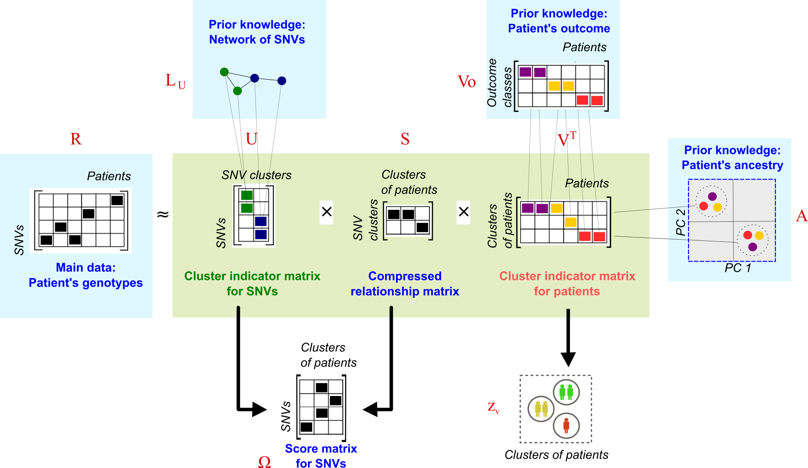

<style type="text/css">

body{
  font-size: 15pt !important;;
}
</style>


----

## Overview  

The  $R$ matrix is approximated as the product of low-dimensional matrices $U$, $V$ and $S$.  Here, we use $L_U$, $V_o$ and $A$ to penalize the factorisation and guide the solutions of $U$  and $V$.




This dimensional reduction provides information for clustering tasks, so $U$ and $V$ are taken as cluster indicator matrices for SNVs and patients respectively. Simultaneously, we compute the product of $U$ and $S$ to generate a score matrix $\Omega$. This matrix summarizes the effect of single SNVs on clusters of patients with specific outcomes and can be used to prioritise the SNVs.  

<br>

---- 

## Consensus clustering and SNV score

<br>

You can run cNMTF with one single function: `score.cnmtf `. This function reads your input data, finds the optimal parameters for the algorithm and provides you with the clusters of patients and the SNV scores, $\Omega$. 

<br>

```{r eval=F, include=TRUE}

library('doParallel')
library("igraph")
library('cnmtf')

	score.cnmtf( R = R, #Relationship matrix
				 out = out, #Categorical outcome variable
				 pop = pop, #Population variable
				 log.file = "logfile_my_experiment", #Log-file to track the performance

				 #Variables to Save/Load data and workspaces
				 name.exp = "my_experiment", #Name of experiment to save files
				 work.dat = "./test/", #Folder to save and load workspaces

				 #Number of clusters
				 define.k = "method", #Method to define k1
				 k1 = c(2,3,5,8,10,15,20), #Number of clusters of SNVs
				 k2 = nlevels(out), #Number of clusters of patients

				 #Penalisation parameters
				 wparameters = list( gamma1 = 0.5, #Weight for the SNV network, Lu
             						 gamma2 = 1, #Weight for the outcome matrix, Vo
             						 gamma3 = 1), #Weight for the kernel matrix, A
				 save.parameters = TRUE, #Save parameters to file
				 run.t.par = 4, #Number of repetitions for parameters fitting
				 max.try0 = 4,  #Maximum number of tries to fit the parameter
				 snps.known = NULL, #List of known SNV associated with the trait

				 #Variables to control performance of the algorithm
				 parallel.opt = TRUE, #Run some instances of the algorithm in parallel
				 n.cores = 3, #Number of cores to use in the parallel processing
				 init = 0, #Type of seeding/initialisation of matrices in the algorithm
				 do.U = TRUE, #Perform clustering of SNPs
				 calcObj = 20, #Check convergency every 20 iterations
				 calcObj2 = 40, #Start checking convergency after first 40 iterations
				 iters = 300, #Number of iterations
				 run.t.exp = 10, #Number of repetitions for the experiment
				 display.iters = FALSE, #Display the iterations of function cnmtf

				 #Randomisations
				 score.pvalues = TRUE, #Estimate p-values for the scores
				 random.parallel = TRUE, #Run each randomisation in parallel
				 randomisations = 100, #Number of randomisations

				 #Construction of penalisation terms
				 file.Gu = "./test/Gu_ppi_test.RData" #Workspace with SNV-SNV network

			)
```

**The arguments for this function are explained as follows.**

<br>

---- 

### The input data

You only must provide the relationship matrix, `R`, the categorical outcome variable, `out`, the population origin of patients if known, `pop` and the SNV-SNV network's workspace, `file.Gu` (generated with the function `create.network`). The algorithm will call internally the functions to create the outcome matrix $V_o$ and the kernel of ancestry, $A$.

<br>

---- 

### The output data

The output files will be labelled by the name of the experiment, `name.exp`, and redirected to the folder that you specifiy in `work.dat`. The algorithm will generate a `log.file` which reports every internal procedure and might be very useful to catch problems in your data.

<br>


---- 

### Define the number of clusters


By default, the number of clusters of patients equals the number of levels in the outcome (*i.e.,* 2 clusters for case-control designs). On the other hand, the algorithm will try to find the optimal number of clusters for the SNVs. This is based on a grid search ($k_1: \{2, 3, 5, 10, \dots \}$ ) while tracking the cluster stability. We use a dispersion coefficient, $\rho_{k_1}$, to summarize the consistency of clustering assignments throughout repetitions of the algorithm. You must define the values of the grid search.


<center> 
 
  **Figure. Finding optimal $k_1$.** The *dispersion coefficient* is tracked for a grid of $k_1$.  values. The *dispersion coefficient* reaches a plateau around $k_1 = 10$, which is the optimum value selected.
  
  </center>

  


<br>


---- 

### Estimate the optimal penalisation parameters

You must weight how much information is transferred from the data sources ($L_u$, $A$ and $V_o$) into $U$ and $V$. By default, the network and genotyping data contribute equally in the final SNV clusters ($w_{L_U} = 0.5$). Also, we aim at achieving maximum separation of cases-controls while minimising the effect of population structures embedded in $R$; therefore, the contribution from $A$ and $V_o$ is maximum ($w_{V_o} = 1$ and $w_{A} = 1$). The algorithm will read a list of weights `list(gamma1 = 0.5, gamma2 = 1, gamma3 = 1)` specifying the contribution from $L_u$, $V_o$ and $A$, respectively.

cNMTF will estimate the optimal parameters that fit the weights provided above. Each parameter is estimated individually in the following order: $\gamma_2$, $\gamma_3$ and $\gamma_1$. For each parameter, cNMTF will create a grid search of 4 elements, `max.try0` (*i.e*, number of tries to fit the parameter). At each of this tries the algorithm will be repeated 4 times, `run.t.par`, and consensus clustering results generated. These consensus clusters are tracked with two variables:

 * We track how the *total node degree* changes when $\gamma_1$ increase. 
 * We track the similarity between clusters, outcome and population ancestry of the patients  when   $\gamma_2$ and $\gamma_3$ change.  


 <center>
 
 

 
  **Figure. Finding optimal penalisation parameters.** The *total node degree* is tracked for a grid of $\gamma_1$ values. The *similarity cluster-outcome* and *similarity cluster-population* are tracked for a grid of $\gamma_2$ and $\gamma_3$ values, respectively. Optimal parameters are: $\gamma_1 = 12$, $\gamma_2 = 8$ and $\gamma_3 = 0.25$.
  
  </center>


See more details about the tracking variables in our publication. 

Once the algorithm finds such penalisation parameters, everything is ready to conduct the factorisation and generate the final results. 

<br>

---- 

### Controlling the performance of the algorithm

The algorithm can run some instances in parallel depending on the available RAM memory of your machine (`parallel.opt = TRUE`). By default, it will run 10 repetitions of the algorithm (`run.t.exp = 10`), through the processor cores that you make available (`n.cores = 3`). For example, the first 3 repetitions of cNMTF will be processed in parallel, after them, another batch of 3 repetitions will be forked in the 3 cores of your machine. The process continues till completing all 10 repetitions. Each core will run a factorisation of your big matrices so requiring enough RAM memory in your machine. It is advisable to keep the number of cores low if your are running cNMTF locally in your regular desktop. 

At each repetition, the algorithm will minimise an objective function. This procedure requires some parameters too:

 * 	Initialisation of $U$, $S$ and $V$ matrices. It can be done randomly, `init = 0`, or by following a Single Value Decomposition based approach, `init = 1` (Boutsidis *et al.*, 2008).  
 
 *  The algorithm performs iterations to find the optimal $U$, $S$ and $V$ matrices. To stop the iterations, any of the following convergence criteria must be fulfilled: 
     + The maximum number of iterations is reached (`iters = 300`).
     + The minimum relative change in the objective function is reached (`tof = 1e-05`).
     
     Such criteria are evaluated after the firt first 40 iterations (`calcObj2`) and then every 20 iterations (`calcObj`).

<br>


---- 

### Creating randomised results

After finishing the main clustering step, the algorithm has the option of factorising  randomisations of $R$, by using the same optimal parameters. We will use these randomisations later to estimate p-values for the SNV scores. You must define whether the randomisations are conducted with `score.pvalues = T`, the number of them: `randomisations = 100` and if running each of them in parallel working in parallel (`random.parallel = TRUE`).

---- 

To this point, the algorithm has processed your data and directed its outputs to "./test/". Your workspace is now ready for [prioritising variants](prioritising.html).
